## **Luban数据加载原理与优化**

[toc]

---

如果初入坑，Luban配置可以参考宝鱼大佬的视频教程 [强力配置工具luban使用教程【01】](https://www.bilibili.com/video/BV1xS4y1M7Aj/?spm_id_from=333.999.0.0)

或者查看官方文档 [快速开始Luban](https://focus-creative-games.github.io/luban/start_up/) 

## 1. 配置Luban并测试

我这里是已经配置好的unity工程，数据使用的是官方案例里的 **MiniTemplate**。为了方便演示，除了生成一份C#代码之外，额外生成一份Json数据。

```
--gen_types code_cs_unity_json,data_json  ^ 
```

代码生成后，自定义增加一个Test脚本进行测试

```csharp
using System.IO;
using cfg;
using UnityEngine;
using SimpleJSON;

public class Test : MonoBehaviour
{
    void Start()
    {
        Tables tab = new Tables(Loader);
        foreach (var n in tab.TbItem.DataList)
        {
            print($"ID:{n.Id};名称:{n.Name};描述:{n.Desc}");
        }
    }
    
    private static JSONNode Loader(string file)
    {
        string path = "Assets/Res/Datas/" + file + ".json";
        return JSON.Parse(File.ReadAllText(path, System.Text.Encoding.UTF8));
    }
}
```

控制台看到如下输出，说明Luban已经配置ok。

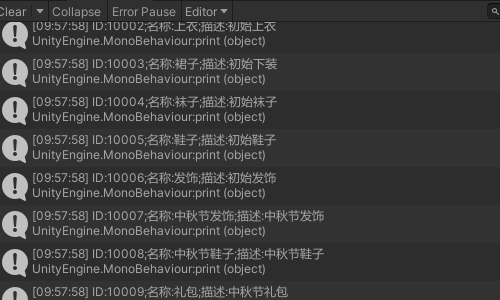

在上面的测试代码里，可以看到当我需要使用Excel数据时，得先去new一个Tables对象，然后通过***.ClassName.DataList*** 或者 ***.ClassName.DataMap***拿到我想要的数据。除此之外，***new Tables()*** 在构造时还需要传入一个装载器，这个**装载器去获取数据源与tables里的各个类对象进行匹配**。

## 2. Luban 数据加载原理

需要了解Luban加载数据的工作原理，我们就需要先来看一下 **Tables** 的构造方法（Tables.cs时自动生成的脚本，在导出目录根路径下）

下图是**默认模板导出的Tables类**，如果你没有使用自定义模板，应该和我一样。

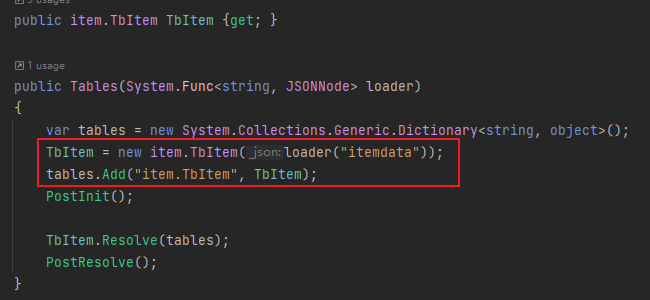

下图是**TbItem表** （表示整张表）内的构造函数

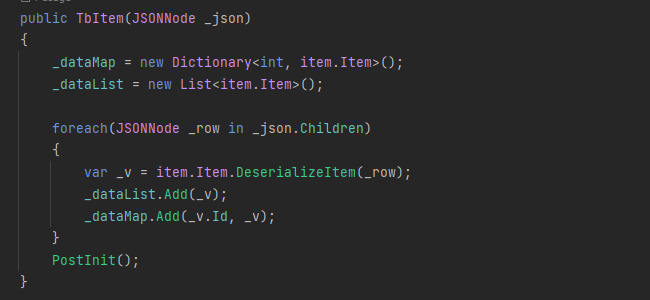

下图是**Item**类（表示每一行数据结构）生成后的构造函数

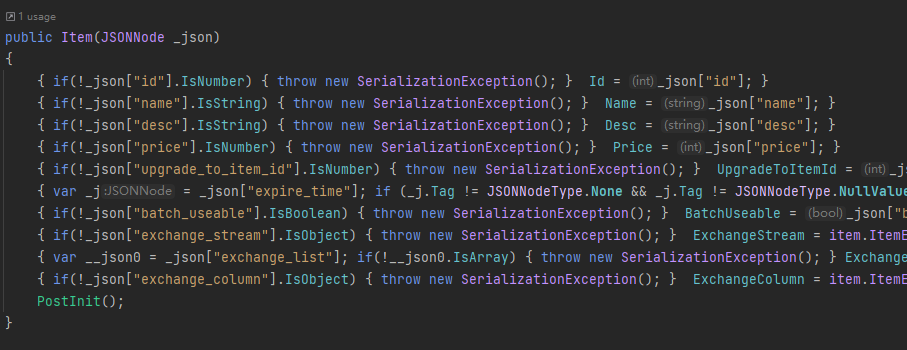

圈重点，通过上面的三个构造方法，可以得知导表后：

<font color = "red"><b>Tables会将已经生成好的表对象（本案例指TbItem）作为自己的一个参数，在构造时通过Loader回调加载源数据的方式（生成的Json数据或者二进制数据）去遍历表中每一行装载数据</b></font>

**现在只导入了一张表，如果多张表Tables会做什么呢？**不妨多加几张表来看看。

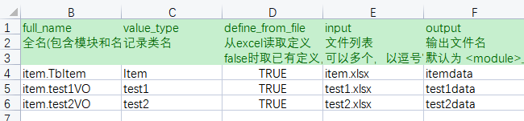

如上图，我在**\_\_tables\_\_.xlsx** 中新增了两张测试表并导出，再来看一下 **Tables** 的构造方法。

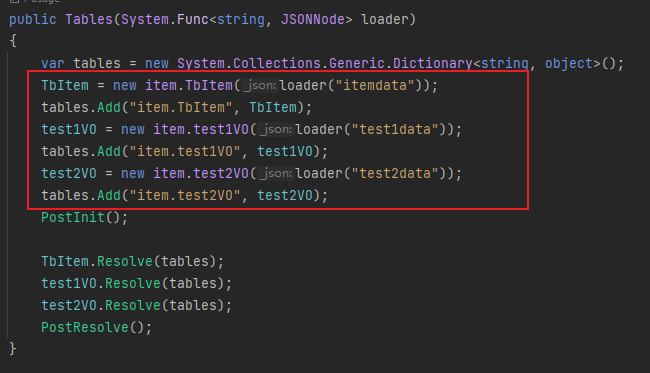

Tables中的对象增加了，也就是说**在new Tables时，它会全量加载，把所有的表对象都new一遍，获取源数据一对一装载，并把他们以表名为key的方式添加进字典里。**

目前来看，**Luban的数据加载方式需要我们在数据管理类中持有Tables对象，并且在具体使用到某张表数据之前进行Tables的预加载。**

## 3. 根据工程进行懒加载优化

由于luban功能强大，所以全量可以支持它这么做。但是对于一般的工程来说，尤其是在游戏开发中拥有海量的数据源，我在初始化时全量加载反而弊大于利，并且为了方便数据管理和程序调用，也用不到那么多的功能。基于此，这里我们可以把这种预加载方式修改为懒加载。

### 3.1 增加公共接口与接口实现方法

定义一个VO接口，内部提供一个数据加载的方法，我这里传入json.text，可自定义。

```csharp
public interface IVOFun
{
    void _LoadData(string data);
}
```

**对每一个生成的表对象，让他们继承IVOFun接口，并在其内部实现_LoadData方法**

这里以默认unity_json案例中的TbItem为例，在它内部实现LoadData

```csharp
public void _LoadData(string data)
{
    JSONNode _json = JSON.Parse(data);
    foreach(JSONNode _row in _json.Children)
    {
        var _v = item.Item.DeserializeItem(_row);
        _dataList.Add(_v);
        _dataMap.Add(_v.Id, _v);
    }
    PostInit();
}
```

### 3.2 外部提供获取数据的方法

在工程中你需要获取数据的地方添加新增Get数据的方法，我这里使用的资源加载方式是Addressables，代码实现原理都一样，根据自己情况只是获取数据源Data的方式不同，但**需要注意的是这里应该使用异步加载与拿到data后释放资源**

这里的思路是定义一个字典 **Dictionary<源数据名称，数据对象>**，需要加载数据对象时先从字典中获取，如果没有再new并加载数据后存入字典中。

```csharp
private const string VO_DATA_PATH = "Res/Datas/";
readonly Dictionary<string, object> tables = new Dictionary<string, object>();

private TextAsset ReadData(string path)
{
    AsyncOperationHandle<TextAsset> op = Addressables.LoadAssetAsync<TextAsset>(path);
    TextAsset res = op.WaitForCompletion();
    Addressables.Release(op);
    return res;
}

public T GetVOData<T>(string fileName) where T : IVOFun, new()
{
    var path = VO_DATA_PATH + fileName + ".json";
    if (tables.ContainsKey(fileName))
    {
        return (T)tables[fileName];
    }
    else
    {
        var data = new T();
        TextAsset text = ReadData(path);
        data._LoadData(text.text);
        tables.Add(fileName, data);
        return data;
    }
}
```

这样一来，便可以在工程中任何节点加载需要使用到的资源。*DataManager.Instance* 是你提供获取数据方法的地方，我这里是一个单例类。

```csharp
TbItem vo = DataManager.Instance.GetVOData<TbItem>("itemdata");
var infos = vo.DataList;
foreach (var n in infos) print($"{n.Name}/{n.Desc}");
```

当然 *GetVOData* 也可以完全不需要传入数据源的文件名称，这一步骤可以将接口的 `_LoadData` 方法修改为不需要传参，让各个表内部自己去获取与自身绑定的数据源。

传参可以额外让两份相同的结构的数据使用同一个表对象，不传参也可以更加便捷，让程序更多的关注在数据使用方面，而不是还需要额外知道数据源的文件名称。这里只是提供一种思路，可以根据自身的使用情况去自定义内部实现。

基于此，已经完成了懒加载步骤的70%，剩下的步骤需找到与模板相对应的文件目录对表定义进行修改。我这里的生成模板是`code_cs_unity_json`，所以来到`Luban.ClientServer/Templates/config/cs_unity_json`目录（该目录下存放了unity的C#脚本生成模板）。如果你是C#二进制模板，应该前往`cs_bin`目录。

### 3.3 对Luban中的导表模板进行修改

截图时，我把行号也截图进去了，修改的位置大致在截图中行号附近。其他类型修改位置还需要自己去详细看一下模板定义。

第一步：**修改 tables.tpl** 

在命名空间与表名之间增加上面定义的接口 **IVOFun**

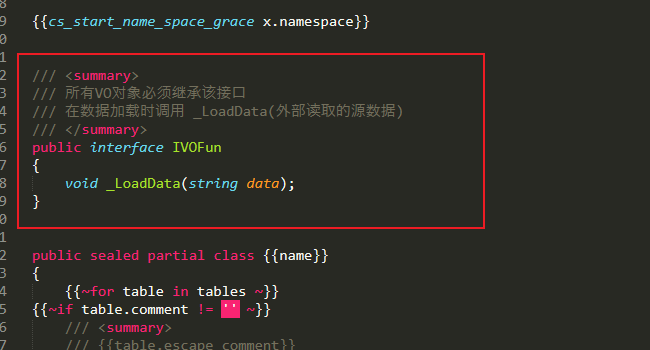

除此之外，还可以去掉冗余代码，将Tables的构造方法置为空。

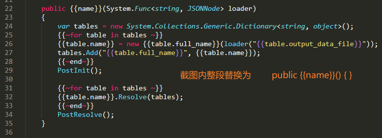

替换后代码如下图所示：

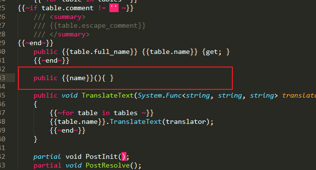

第二步：**修改 table.tpl** 

在类名后增加继承接口 **IVOFun**

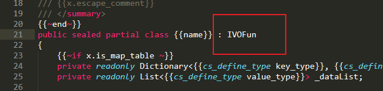

修改table构造函数

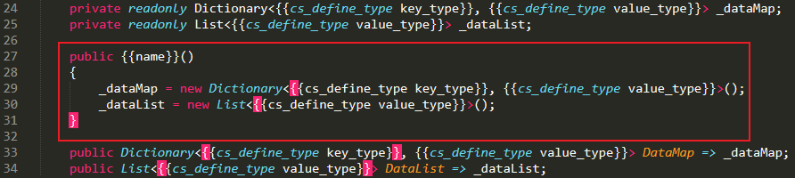

在末尾增加接口实现方法

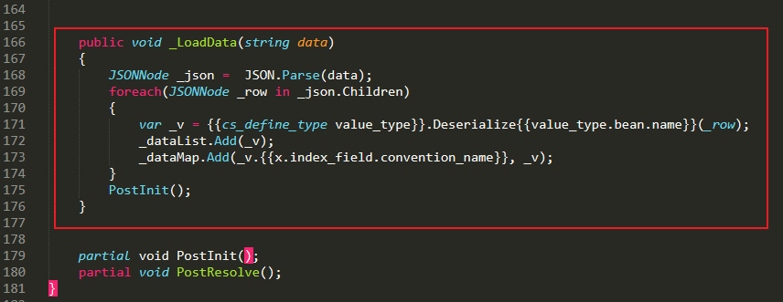

至此，已经完全完成了懒加载的修改，可以重新导出脚本了。

## 4. 优化后测试

完成第3节后，需要重新导入一次，我这里新建一个测试脚本。

```csharp
using cfg.item;
using UnityEngine;

public class LazyTest : MonoBehaviour
{
    void Start()
    {
        TbItem vo = DataManager.Instance.GetVOData<TbItem>("itemdata");
        var infos = vo.DataList;
        foreach (var n in infos)
        {
            print($"{n.Name}/{n.Desc}");
        }
        
    }
}
```

运行游戏，可以看到控制台成功打印信息。

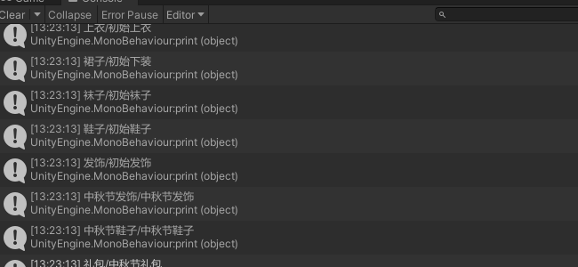

---

Author：文若

DateTime：2022-11-16
