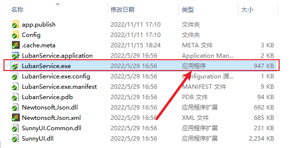
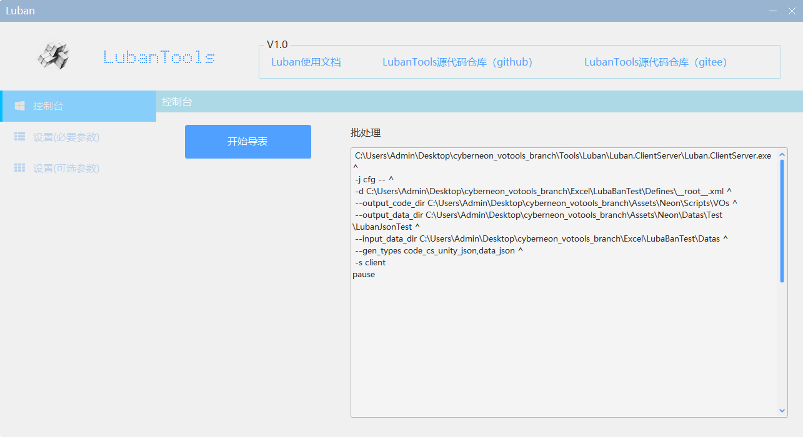
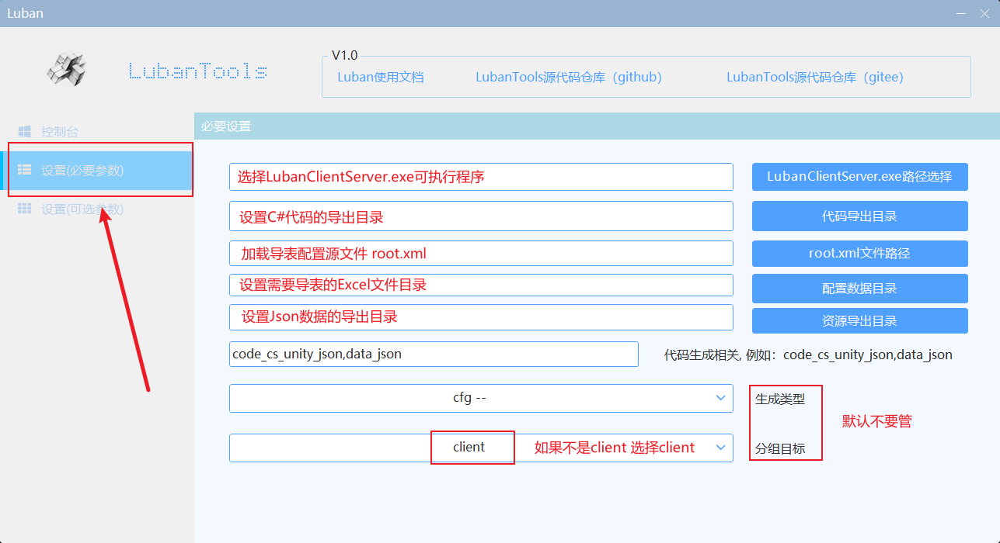
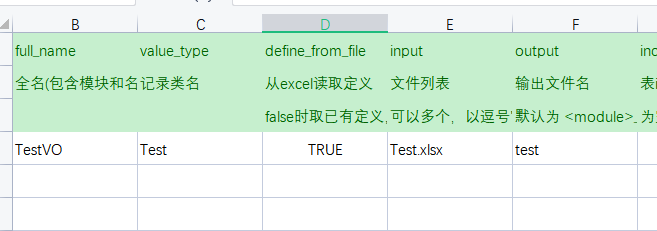
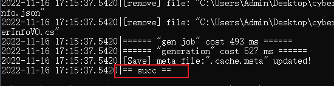

## VO_README

### 1. 检查环境配置

首先需要确保计算机有 [dotnet sdk 6.0+](https://dotnet.microsoft.com/en-us/download/dotnet/6.0) ，没有的话需要在你当前本机安装一下。

打开终端并运行以下命令查看当前安装的 .NET SDK 版本，如果不包含6.0+，则需要自行下载安装。

```
dotnet --list-sdks
```

### 2. 配置导表工具

找到工程与**Assets**同级的目录`Tools\luban_export_tool`，打开文件 **LubanService.exe**

⚠ **LubanService.exe** 是一个**可执行应用程序**，如果你的计算机没有设置显示文件后缀名，那么打开的可能是*LubanService.exe.config*文件



打开程序后，将会看到如下可控制台界面



选择 **左侧设置（必要参数）**打开路径配置界面，按照下图说明点击右侧蓝色按钮选择到指定目录。



设置好了以后返回控制台。

**root** 指定是当前工程所在路径，一般都是Assets目录的父级

- **Exe路径：** `root/Tools/luban_client_server/LubanClientServer.exe`
- **C#代码导出目录：** `root/Assets/Neon/Scripts/VOs`
- **root.xml文件路径：** `root/Excel/Defines/__root__.xml`
- **配置数据（Excel）目录：** `root/Excel`
- **资源（Json）导出目录:** `root/Assets/Neon/Datas/LuBanTest`

如果代码生成栏配置为空或者不是下面代码，复制下面的代码填充

```
code_cs_unity_json,data_json
```

生成类型选择 cfg-- 

分组目标选择 client

### 3. 新增表并导出

假设新增一张表Test.xlsx，表中已经填好了内容。

打开导表工具的全局配置表 `root/Excel/__tables__.xlsx`将刚才新建的表填写进配置表中



⚠ **填写规则**

- full_name：**表名路径+标记** 标记一般补充VO，或者TB。以Test表为例，如果该表名在Excel根目录下，则只填写 **TestVO**，或TestTB，如果Test表在Excel的子文件夹Item下，则填写**Item.TestVO**或者Item.TestTB
- value_type：填写文件名称，如Text.xlsx 填写 **Test**，full_name的VO就是用作和这个类做区分。
- define_from_file：不要管，统一为 **TRUE**
- input：区别full_name。它是 **表名路径+后缀**，还是以Test.xlsx为例子，如果他在Excel文件夹下，则为 **Test.xlsx**，如果它在Excel的子文件夹Item下，则为 **Item.Test.xlsx**
- output: 均小写为输出的**json文件名称**，可自定义，建议直接写value_type的全小写。

`__tables__.xlsx` 配置完成后，回到GUI工具，点击 **开始导表** 



此时会弹出控制台窗口，当看到 == succ== 则表示导表成功，如果出现黄色字幕，则需要根据报错信息检查表格内容或表格配置是否正确。

### 4. 程序代码调用

导表时的全局配置中，程序这边需要记住 `full_name` 和 `output` 两个名称，如果full_name在某一子文件夹下，如 `Item.TestVO`，则只需要知道TestVO即可，它将是你在代码中获取数据的VO对象。

使用方法：**DataManager.Instance.GetVOData<`vo_name`>(`json_file_name`);**

代码示例：

```csharp
// 获取VO对象
TestVO voData = DataManager.Instance.GetVOData<TestVO>("test");
// 以list的方式读表
var list = voData.DataList;
// 以map的方式读表，它是一个含有Id的list，id一般是第一列数据（唯一）
var map = voData.DataMap;
// 拿到表中的某一行数据 id为主键
var vo = voData.Get(1005);
```

如果无法获取数据，需要检查`DataManager`中的配置的加载数据路径是否正常。

**VO_DATA_PATH** 即Json数据的导出目录

```csharp
private const string VO_DATA_PATH = "Neon/Datas/LubanTest/";
```

