Excel配置工具使用指南

[toc]

## 1. 环境搭建

- 首先需要确保计算机有 [dotnet sdk 6.0+](https://dotnet.microsoft.com/en-us/download/dotnet/6.0) ，没有的话需要在你当前本机安装一下。

- 该vo工具基于luban插件。本文档只适配当前项目进行案例演示。需要详细了解和扩展阅读的同学请翻阅[Luban官方文档](https://focus-creative-games.github.io/luban/about/)

## 2. 需要了解的导表配置

Cyber的VO导表工具和源excel表分别存放在工程里 **Tools** 和 **Excel** 的子级文件夹中。

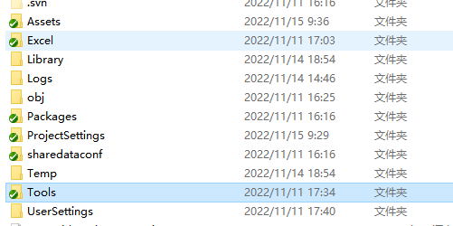

先看Tools/Luban子级目录有两个文件夹

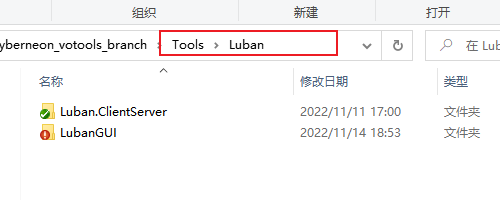

- ⚠ **Luban.ClientServer** 该文件夹下的任何内容在一般情况下 <font color = "red"><b>严禁新增或修改</b></font>

  如特殊情况，需要修改生成的代码格式，策划请找文若，程序你可能需要做以下工作：

  - 在*Templates*文件夹的每一级子文件夹下找到需要生成代码相关的tpl文件
  - 在tpl文件中进行代码格式修改，必须注意变量名称的引用，修改之前最好备份源文件
  - 只能修改class内部的内容，比如c#脚本中，class花括号包裹内的内容可以修改，花括号之外的任何内容不得修改
  - 修改完成后必须在编辑器或编译器下进行测试
  - 测试通过更新，如果发生错误，回退源文件。

- **LubanGUI** 是我们的临时界面导表工具，`LubanService.exe`需要在工程中使用。在设置处配置必要参数，控制台点击开始导表。只有一个导表按钮，只需要一次配置，确定好表目录和导出文件目录后，尽量不要再次修改目录。

  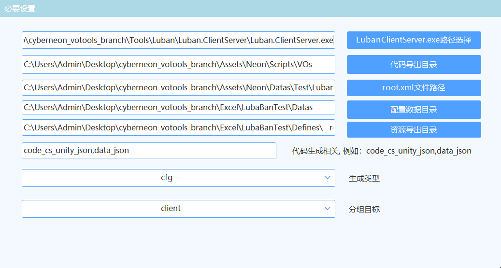

  当前分支的临时配置目录：

  - **源Excel目录：** *root/**Excel**/LubaBanTest/Datas* 
  - **导表工具目录：** *root/**Tools**/Luban/LubanGUI* 
  - **资源导出目录：** *root/**Assets**/Neon/Datas/Test/LubanJsonTest* 
  - **代码导出目录：** *root/**Assets**/Neon/Scripts/VOs*
  - **ClientServer：** *root/**Tools**/Luban/Luban.ClientServer/Luban.ClientServer.exe*

## 3. 导表前需要知道

⚠**导表一定需要注意的几点**

1. 输出目录下存放的导表后的json或者vo文件，<font color ="red"><b>切记不能在输出目录中新增文件</b></font>。如果错误的增加了新文件，下一次导表工作执行后，将全目录覆盖，新增文件将被删除。
2. 输出的VO文件都是自动生成的，不建议修改。如果是格式上的修改，需要在*Luban.ClientServer/Templates*目录下找到对应的table模板进行编辑。
3. 策划同学在填表时<font color ="red"><b>需要严格按照本文档excel填表规范</b></font>。尤其注意类型type行所填写的类型在可支持类型中，填表之前请先阅读本文档全篇。

## 4. Excel导表工具

### 4.1 支持的类型

**基础内置类型：**

- bool,byte,short,fshort,int,fint,long,flong,float,double,string,text,bytes
- vector2, vector3,vector4
- datetime

**自定义枚举eunm，自定义结构bean**


### 4.2 常规表规则

1. 第一行表示字段 第一个单元格必须为 ## 表示这孩子那个表为有效的数据表
2. 第二行表示类型 第一个单元格必须为 ##type，类型可以填写4.1的所有类型
3. \#\# 表示注释行，可以有N个注释行，并且注释行可以标记在任何位置
4. \#\#group c/s分组标记行，用来标记某一列数据是客户端表还是服务器表数据，不填为all。目前的需求来说暂时不需要，在4.3Demo中不做展示。
5. 第五行起为数据行

|##var|  id|name |attr |relic|stars|talent|desc|
|:-:  |:-: |:-:  |:-:   |:-: |:-:           |:-:   |:-:|
|##type |int|name|string|string|int|string|string|
|##group|  |   |     |     |     |     |     |
| ##           | Id | 名字 | 属性     | 圣遗物 | 命座  | 天赋    | 描述|
||1001|香菱|火|精精爆|6|8,8,9|提瓦特枪王|
||1002|行秋|水|充水暴|6|8,8,8|腿真好看|
||1003|班尼特|火|生生治|6|10,13,13|六星真神|
||1004|影|雷|充雷爆|2|8,8,9|不会做饭|
||1005|巴巴托斯|风|攻攻攻|2|8,8,8|酒量很好|
||1006|钟离|岩|生生生|0|9,9,9|没有摩拉|

### 4.3 导表流程

#### 4.3.1 【策划】表配置

**第一步：**根据4.2样本，请**复制上面的表格**直接填充在excel，命名为 ***CharacterInfo.xlsx*** ，并把这张表保存在Datas目录下

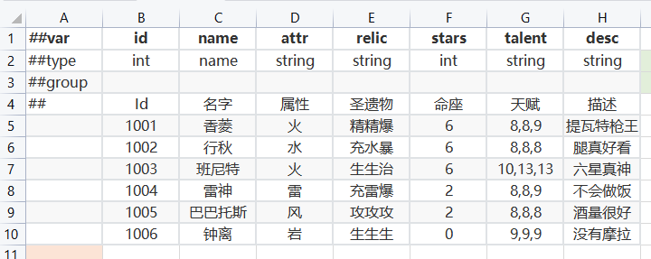


**第二步：** 在全局配置表**\_\_tables\_\_.xlsx** 里新增一行配置。

命名规范：fullname文件名后加VO，方便程序分别。value_type保存为表名即可。

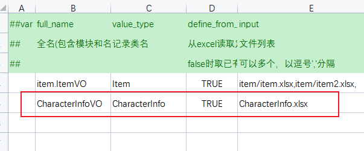

**几个必选参数**

**full_name** 表示生成的VO数据结构文件名称。它是包含模块名称的！如果不指定模块，导出的文件在根目录中。比如，当前工程输出目录为 **Assets**/Neon/Scripts/VOs

- item.ItemVO  生成ItemVO.cs，路径名称为 Scripts/**VOs/item/**ItemVO.cs
- CharacterInfoVO 生成文件CharacterInfoVO.cs，路径名称为 Scripts/**VOs/**CharacterInfoVO.cs

**value_type** 指的是vo对象，它与结构表中的每一行相对应，它将每一行抽象成一个对象并存放在VO类的数据结构中。

**define_from_file** 默认填写为TRUE，它表示excel文件的读取规则，相对于cyber工程来说，目前这里可以不考虑flase，只填true。

**input** 表示输出文件，填写到后缀名，当前源excel目录root为Datas，如果还有子文件夹，需要指定文件夹名称。

**其他参数**

其他参数如： index，mode，group，comment 等暂时可以不填写，需要注意是 **output** 参数，它指的是输出目录的文件名称。如果不指定名称，则默认以**\<module\>\_\<name\>.\<json\> ** 的形式存放在配置的资源导出目录中。在本案例中，**output 填写为ccinfo**，一边情况下，为了方便目录管理，**output建议为必填参数**


**第三步：** 经过前两步，策划这边的配置任务已经完成了，接下来打开导表工具点击**开始导表**。导表成功后即可在工程中查看文件。

😒等等，是不是发生了什么问题？

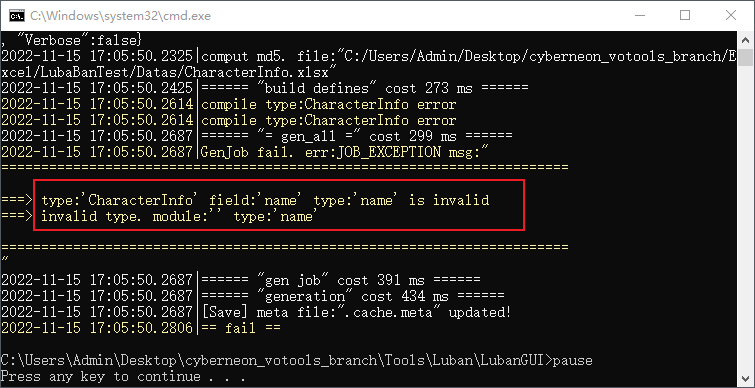

导表失败：报错信息为 **CharacterInfo** 的字段 **name** 定义的类型 为 name。

是的，这是我在创建表格时留下的坑，将字段name的类型写作 name，由于name不是基础内置类型中所支持的引用。所以导表工具可以根据匹配结果明确指出填写错误的位置或者单元格（如果类型错误会定位到具体的单元格，如下图所示）

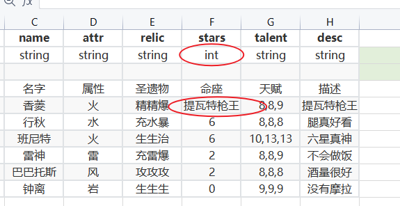

starts参数为int值，填写为string，导表工具报错如下:

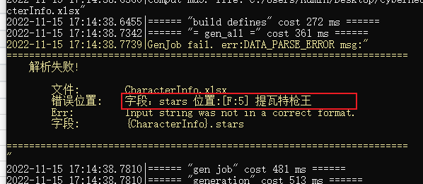

出现诸如上述简单的可检查错误，**需要策划同学根据报错信息自行修改**，如果有看不懂的地方或者不会修改摇人。

**当看到succ时才是导表成功！**

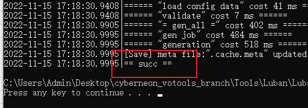

⚠备注：如果导表成功后，鼠标无法点击其他页面，请先点击黑色弹窗并按下键盘任意键。

**第四步：** 导表成功后，需要在工程中核对是否新增VO脚本和json脚本

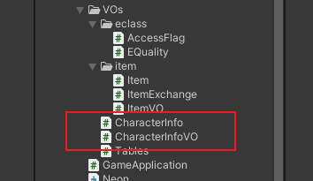

如上图所示，导表成功后，会在VOs下新增两个脚本（目录结构在**\_\_tables\_\_.xlsx** 中自定义），以VO为后缀的是程序开发时需要使用到的脚本，另一个则是表格对象不需要关注。

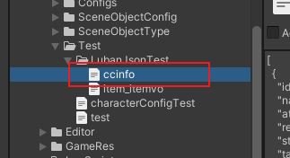

json数据保存在设置好的资源导出目录中，策划同学需要留意下json脚本中数据是否存在。避免因**_\_tables\_\_.xlsx** 中配置相同output名称而覆盖另一份数据。

**快速验证** 在工程中已经预留了测试脚本，把TestVOData挂载任意场景物体上，执行观察到控制台有如下输出，则导表成功。

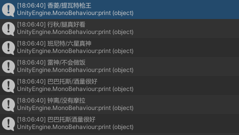


#### 4.3.2 【程序】代码调用

程序在导表流程中需要关注**三个比较重要**的点：

- VO脚本名称
- json脚本的名称
- 数据类型的改变 SimpleJosn替换掉了LitJson

在数据管理 **DataManager** 中提供了vo对象获取方法。

```csharp
/// VO对象的数据源地址，即json文件的导出目录
private const string VO_DATA_PATH = "Neon/Datas/Test/LubanJsonTest/";
```

***GetVOData(json文件名称)*** 这里传入的参数就是导出目录的文件名称

```csharp
public T GetVOData<T>(string fileName) where T : IVOFun, new(){ }
```

Vo中包含两个数据结构，一个是**DataList**，另一个是**DataMap** , （DataMap是含有key的DataList）

此外，提供一个Get方法，需要先拿到Vo对象，具体示例如下：

```csharp
CharacterInfoVO vo = DataManager.Instance.GetVOData<CharacterInfoVO>("ccinfo");
var infos = vo.DataList;
foreach (var n in infos)
    print($"{n.Name}/{n.Desc}");

// Get()需要先获得vo对象
var babatuosi = vo.Get(1005);
print(babatuosi.Name + babatuosi.Desc);
```


### 4.4 基础表填表规范

以***CharacterInfo***为例，如下图所示：


<font color ="red"><b>Excel简单表填表规范</b></font>与需要注意的点

- 策划同学详细阅读导表流程

- 第一列 \#\#var 表示字段 表格第1行填写字段名称

- \#\#type表示类型 类型行紧跟字段行，填写在表格第2行

- \#\#group 该行可填写可不填写，特可以控制输出的列数，建议第3行首个单元格填写\#\#group,之后为空行（进阶表可用作客户端表扩列）

- 第四行\#\# 为注释行，给策划同学用，进行字段标注说明等

- 第五行开始为数据内容，**数据内容行的首个单元格必须为空**

- float型，即使为整数，需要增加小数点，如 浮点数3 填写为 3.0

- 如果某一行数据暂时不导表，请在改行预留的首个空单元格填写\#\# 将该行注释

- **\_\_tables\_\_.xlsx** 表中的fullname需要在表名末尾加上VO标记，如item.itemVO,CharacterVO

- **\_\_tables\_\_.xlsx** output输出josn文件名均为小写

  

## 5. 进阶配置与说明（TODO）

目前项目中暂时还用不到，后面慢慢扩充文档。
